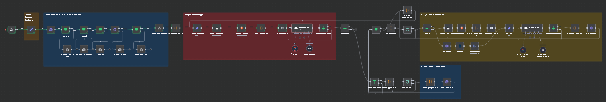
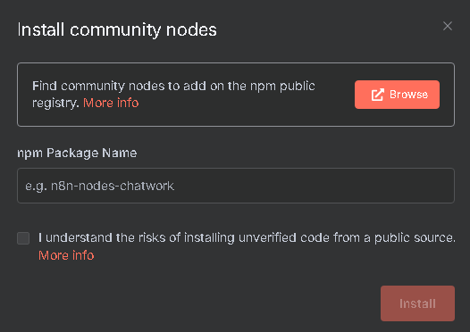
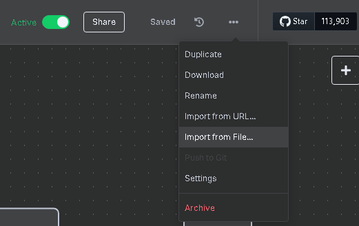
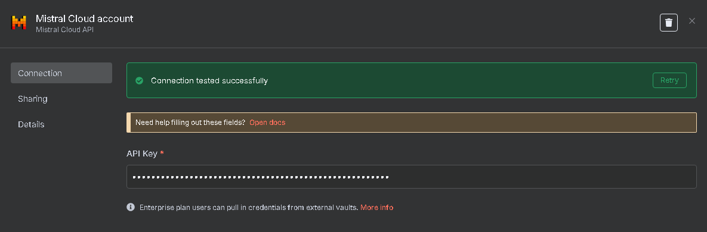

# 🧪 Clinical Trials Data Extraction (AI Scraper)

Automated extraction of clinical trial data from websites.  
This project uses a **n8n** workflow to automate the **ETL** (Extract, Transform, Load) process into a **Neo4j** database.

---

## 📸 Preview

<p align="center">
  
</p>

---

## 🧠 How It Works

The n8n workflow performs the following steps:

1. Takes as input a **search results URL** containing a pagination parameter, e.g.:
   - [https://clinicaltrials.gov/search?limit=10&page=](https://clinicaltrials.gov/search?limit=10&page=)
   - [https://archimaid.fr/?spec=&loc=&situ=&trait=&part=&type=&terrid=&center=&phase=&line=&stade=&kw=&open=1&age=&sexe=&oms=&size=10&tts=false&page=](https://archimaid.fr/?spec=&loc=&situ=&trait=&part=&type=&terrid=&center=&phase=&line=&stade=&kw=&open=1&age=&sexe=&oms=&size=10&tts=false&page=)
   - [https://www.cancer.fr/pages-transverses/resultats-de-recherche?production_fre-FR_default&page=](https://www.cancer.fr/pages-transverses/resultats-de-recherche?production_fre-FR_default&page=)
2. Crawls the results pages using **Puppeteer**, extracts detail page links using a **LLM** (Large Language Model), by converting HTML to markdown and asking the model to extract links.
3. For each trial detail page, extracts structured data (title, description, start/end dates, etc.) via LLM, and saves the data into a **Neo4j** graph database.


---

## 🚀 Installation

### 1. Install `npm` and `pnpm` (if not already installed)
- [Node.js installation guide](https://nodejs.org/en/download/)
- [npm installation guide](https://www.npmjs.com/get-npm)
- [pnpm installation guide](https://pnpm.io/installation)

### 2. Install `n8n` globally

```bash
npm install n8n -g
```

### 3. Start n8n

```bash
n8n start
```

Open n8n in your browser: http://localhost:5678

---

## 🧩 Workflow Setup

### 📦 Install required Community Nodes

#### 🔧 Option 1: Via the n8n Interface

- Go to **Settings > Community Nodes** ➜ ([http://localhost:5678/settings/community-nodes](http://localhost:5678/settings/community-nodes)) :

<p align="center">
  
</p>

- Search for and install the following node:
  - `n8n-nodes-puppeteer`

If the node doesn't work immediately, restart n8n:
```bash
n8n stop
n8n start
```
If it still doesn’t appear, proceed with Option 2.

#### 💻 Option 2: Manual Installation via Terminal

Open a terminal and run the following commands to install the nodes:
```bash
cd C:\Users\<YourUsername>\.n8n\nodes
pnpm install n8n-nodes-puppeteer
```
Then restart `n8n` :
```bash
n8n stop
n8n start
```

### 📥 Import the Workflow

#### 🖱 Option 1: From File
- In the n8n UI, create a new workflow.
- Click the three dots (⋮) in the top right > **Import from file**
- Select the file [`workflows/AIScraperAPI.json`](workflows/AIScraperAPI.json).

<p align="center">
  
</p>

#### 📋 Option 2: Copy-Paste the JSON
- Create a new workflow in n8n
- Open the [`workflows/AIScraperAPI.json`](workflows/AIScraperAPI.json) file.
- Copy the entire JSON and paste it into the workflow editor (CTRL + C to copy, CTRL + V to paste).

### 🔐 Configure Credentials
In the imported workflow, you'll need to configure credentials for:
- **Mistral** (or another LLM provider)
<p align="center">  </p>

### 🗄️ Database Setup
You need to run Neo4j locally.<br>
The backend to insert data is available here ➜ [Clinical Trials Backend](https://github.com/Luxray555/ClinicalTrials)

### ✅ Activate the Workflow
In n8n, activate the workflow by clicking the activation toggle at the top right:
<p align="center">
  
</p>

---

## ▶️ Run the Workflow

Trigger the workflow with the following HTTP request:

```bash
curl -X GET http://localhost:5678/webhook/AIScraper?url=https://clinicaltrials.gov/search?limit=10&page=
```
🟢 Expected result:
```json
{
  "status": "STARTED",
  "id": "977",
  "stopUrl": {
    "url": "http://localhost:5678/api/v1/executions/977",
    "method": "DELETE"
  }
}
```

---

## ⛔ Stop the Workflow

To stop the workflow execution manually:

```bash
curl -X DELETE http://localhost:5678/api/v1/executions/977
```

---

## 📄 Licence

This project is licensed under the MIT License.
